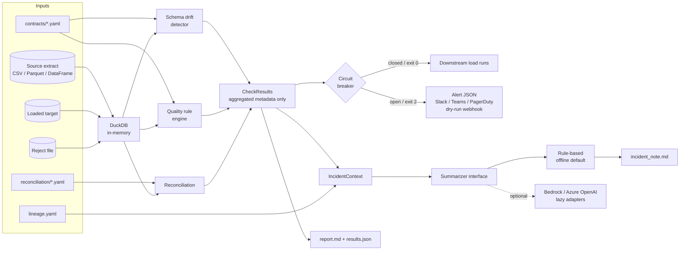

# Pipeline Reliability Toolkit

[](https://github.com/vijayakompalli9/pipeline-reliability-toolkit/actions/workflows/ci.yml) [](https://github.com/vijayakompalli9/pipeline-reliability-toolkit/actions/workflows/demo.yml) 

> **Portfolio project.** Independently built demonstration using synthetic data. It is not code from, or affiliated with, any current or former employer or client. Developed with AI-assisted tooling and reviewed by the author.


Production pipelines at regulated firms rarely fail loudly. More often they break quietly: an upstream export changes a column type, a loader dies halfway through and a retry appends the same rows twice, or a file arrives a day late. Reports still refresh, but the numbers are wrong. The on-call engineer then spends hours working out which of those things happened. This toolkit is a lightweight, config-driven **reliability gate** that runs between "data landed" and "data published". It checks data quality against YAML contracts, detects schema drift, reconciles source with target, and **trips a circuit breaker** (non-zero exit code plus an alert payload) so downstream loads stop. It also writes a plain-language incident note that names the likely root cause and the blast radius, so triage takes minutes.

## Try it without installing anything

1. Open the [**Run demo** workflow](https://github.com/vijayakompalli9/pipeline-reliability-toolkit/actions/workflows/demo.yml).
2. Click **Run workflow** (you need to be signed in to GitHub), then open the run when it finishes, in about 2–4 minutes.
3. Read the results on the run's **Summary** page, or download the `*-demo-output` artifact.

The demo generates a synthetic payments load with five injected defects (type drift, missing rows, duplicates, a late file, orphan references), runs contracts, drift detection and reconciliation, and posts the reliability report and incident note to the run summary. The gate step exits with code 2, which is how a real pipeline would stop a downstream load.

Tested with Python 3.11 / 3.13 · DuckDB. Every push to `main` also runs the [CI workflow](https://github.com/vijayakompalli9/pipeline-reliability-toolkit/actions/workflows/ci.yml): lint, the full test suite and a smoke run.

## What this demonstrates

- **Data contracts as code**: YAML per dataset with schema (names, types, nullability) and 8 rule types at `warn` or `critical` severity
- **Schema drift classification**: added, removed and type-changed columns, each sorted into *breaking* or *non-breaking* (safe widening such as `INTEGER -> DOUBLE` passes, `INTEGER -> VARCHAR` does not)
- **Financial-grade reconciliation**: row counts, control totals (column sums), duplicate keys, null thresholds and rejected-record accounting, each with an absolute or percentage tolerance
- **Circuit breaker pattern** for orchestrators: exit codes, a `CircuitOpenError` for Airflow tasks, and Slack, Teams and PagerDuty-shaped alert bodies (sending is a dry run by default)
- **GenAI behind a security boundary**: an offline rule-based summarizer by default. Optional Bedrock and Azure OpenAI adapters are built lazily, and the prompt contains **only aggregated metadata, never rows**
- **Lineage-aware blast radius** from a small lineage YAML
- **Engineering hygiene**: `src/` layout, type hints, key=value structured logging, custom exceptions, 70 pytest tests including an end-to-end run, ruff, Docker and GitHub Actions CI

## Architecture



## Tech stack

Python 3.11+, DuckDB (all checks run as aggregate SQL), pandas (synthetic data and DataFrame inputs), PyYAML, pytest and ruff. Optional extras: `boto3` (Bedrock) and `openai` (Azure OpenAI). Neither is needed to run or test.

## Project layout

```
pipeline-reliability-toolkit/
├── configs/
│   ├── contracts/payments_source.yaml     # schema + rules for the incoming extract
│   ├── reconciliation/payments.yaml       # source vs target, tolerances
│   └── lineage.yaml                       # downstream graph for blast radius
├── src/reliability/
│   ├── contracts.py      # YAML contract model + validation
│   ├── rules.py          # 8 rule types, each one aggregate SQL query
│   ├── drift.py          # schema drift detection + breaking classification
│   ├── reconcile.py      # counts, control totals, dupes, nulls, reject accounting
│   ├── breaker.py        # circuit breaker, exit codes, alert payloads, webhook stub
│   ├── lineage.py        # BFS blast radius
│   ├── summarizer/       # context (security boundary), rule_based, llm adapters
│   ├── pipeline.py       # high-level API used by CLI / demo / Airflow
│   ├── report.py         # markdown run report
│   ├── io.py             # CSV / Parquet / DataFrame -> DuckDB (UTC pinned)
│   ├── cli.py            # `reliability check | reconcile`
│   └── demo.py           # seeded synthetic data with injected defects
├── examples/
│   ├── airflow_dag.py            # gate task blocks the publish task
│   └── github_actions_gate.yml   # CI-style data gate
├── tests/                # 70 tests: rules, drift, recon, breaker/CLI, summarizer, e2e
├── docs/sample_output/   # real output of `make run`
├── Dockerfile, Makefile, pyproject.toml, requirements*.txt, .env.example
└── .github/workflows/ci.yml
```

## Quickstart

```bash
python3 -m venv .venv && source .venv/bin/activate
pip install -r requirements-dev.txt && pip install -e . --no-deps   # or: make install

python -m reliability.demo        # or: make run   -> writes docs/sample_output/
pytest                            # or: make test
ruff check .                      # or: make lint
```

CLI against your own files:

```bash
reliability check --contract configs/contracts/payments_source.yaml \
  --data data/demo/payments_source.csv --data policies=data/demo/policies.csv \
  --lineage configs/lineage.yaml --out-dir out/check --alert-format slack --alert-format pagerduty

reliability reconcile --config configs/reconciliation/payments.yaml \
  --source data/demo/payments_source.csv --target data/demo/payments_target.csv \
  --rejected data/demo/payments_rejected.csv
```

| Exit code | Meaning |
|---|---|
| `0` | Circuit **closed**: no blocking failures (warnings allowed) |
| `2` | Circuit **open**: at least one failure at or above `--fail-on` (default `critical`) |
| `3` | Tool or config error (bad YAML, missing file, missing `--rejected`) |

## Sample output

The demo generates a seeded "payments" feed for *Northwind Mutual Insurance (fictional)*: 5,000 premium, claim and refund payments. Five defects are injected: `branch_code` drifts from integer to string (`BR-0123`), 3% of rows (150) are silently missing from the target, 20 rows are rejected and properly logged, 25 rows are duplicated by a retry, the file is 30 hours late, and 6 payments reference unknown policies.

Real CLI output (trimmed):

```
$ reliability check --contract configs/contracts/payments_source.yaml --data data/demo/payments_source.csv --data policies=data/demo/policies.csv --as-of 2026-09-30T06:00:00+00:00
FAIL  critical drift          payments_source.column_type_changed[branch_code]: BREAKING: incompatible type integer -> string
PASS  critical quality        payments_source.not_null[payment_id]: 0 null rows (0.0%)
...
PASS  critical quality        payments_source.unique[payment_id]: 0 keys duplicated, 0 extra rows
FAIL  warn     quality        payments_source.freshness[event_ts]: newest record is 30.0h old (limit 24h)
PASS  critical quality        payments_source.row_count_min: 5000 rows (minimum 1000)
FAIL  warn     quality        payments_source.referential[policy_id]: 6 rows reference 6 keys missing from policies.policy_id
circuit=open exit_code=2 :: 1 blocking failure(s): column_type_changed:branch_code

$ reliability reconcile --config configs/reconciliation/payments.yaml --source ... --target ... --rejected ...
FAIL  critical reconciliation payments_target.row_count: source=5000 target=4855 diff=145 (2.9%)
FAIL  critical reconciliation payments_target.control_total[amount]: sum(amount) source=6,428,556.83 target=6,212,911.61 diff=215,645.22
FAIL  critical reconciliation payments_target.duplicates[payment_id]: 25 keys loaded more than once (25 extra rows)
PASS  warn     reconciliation payments_target.null_threshold[policy_id]: 0.0% null in target (limit 0.5%)
FAIL  critical reconciliation payments_target.rejected_accounting: 170 source keys missing from target; 20 explained by rejects; 150 unaccounted
circuit=open exit_code=2 :: 4 blocking failure(s): row_count, control_total:amount, duplicates:payment_id, rejected_accounting
```

Excerpt from the generated [`docs/sample_output/incident_note.md`](docs/sample_output/incident_note.md):

```markdown
## Likely cause

1. **Upstream schema change**: `payments_source`.`branch_code` arrived as `VARCHAR` instead of `integer`. ...
2. **Failed-then-retried load**: rows are both missing and duplicated in the same run, which matches a batch
   that aborted mid-way and was re-run with append (not merge) semantics: some chunks were written twice, others never.
3. **Partial load** into `payments_target`: 150 source rows are missing with no reject record.
...
## Blast radius

| Downstream dataset | Hops | Owner | Criticality |
|---|---|---|---|
| `agg_claims_paid_by_line` | 1 | actuarial-analytics | medium |
| `fct_daily_cash_receipts` | 1 | finance-analytics | high |
| `dash_treasury_liquidity` | 2 | treasury | high |
| `rpt_loss_ratio_monthly` | 2 | actuarial-analytics | medium |
| `rpt_statutory_cash_flow` | 2 | regulatory-reporting | critical |
```

Full set: [`report.md`](docs/sample_output/report.md), [`incident_note.md`](docs/sample_output/incident_note.md), [`results.json`](docs/sample_output/results.json), and alerts for [Slack](docs/sample_output/alert_slack.json), [Teams](docs/sample_output/alert_teams.json) and [PagerDuty](docs/sample_output/alert_pagerduty.json).

## Configuration

**Contract** (`configs/contracts/*.yaml`):

```yaml
dataset: payments_source
schema:
  - {name: payment_id, type: string, nullable: false}   # non-nullable => implicit critical not_null
  - {name: amount,     type: number, nullable: false}
drift: {allow_added_columns: true}                      # false => new columns are breaking
rules:
  - {type: unique,          column: payment_id, severity: critical}   # or columns: [a, b]
  - {type: range,           column: amount, min: 0, max: 250000}
  - {type: regex,           column: currency, pattern: '^[A-Z]{3}$', severity: warn}
  - {type: accepted_values, column: status, values: [SETTLED, PENDING]}
  - {type: freshness,       column: event_ts, max_age_hours: 24}
  - {type: row_count_min,   min: 1000}
  - {type: referential,     column: policy_id, ref_table: policies, ref_column: policy_id}
  - {type: not_null,        column: branch_code, max_null_pct: 1.0}
```

Logical types: `string`, `integer`, `number`, `boolean`, `date`, `timestamp`. DuckDB types such as `BIGINT` or `DECIMAL(18,2)` are also accepted.

**Reconciliation** (`configs/reconciliation/*.yaml`): `row_count`, `control_totals[]`, `duplicates`, `null_thresholds[]` and `rejected_records`. Each takes `severity` and either `tolerance_abs` or `tolerance_pct` (or `tolerance_rows` / `max_null_pct`). A check passes when `|source - target| <= max(tolerance_abs, tolerance_pct% of source)`.

**Environment** (`.env.example`): `RELIABILITY_WEBHOOK_URL`, `RELIABILITY_ALERT_DRY_RUN` (default `true`), `PAGERDUTY_ROUTING_KEY`, `RELIABILITY_SUMMARIZER` (`rule_based` | `bedrock` | `azure_openai`), and the provider variables. None of these are needed for the default path.

## Orchestration

- **Airflow** ([`examples/airflow_dag.py`](examples/airflow_dag.py)): `extract -> load_staging -> reliability_gate -> publish_reporting_marts`. The gate calls `CircuitBreaker.guard()`, which raises `CircuitOpenError`, so the publish task never runs on bad data. Airflow imports are guarded (Airflow 2 or 3 paths), and the gate function is tested without Airflow installed.
- **GitHub Actions** ([`examples/github_actions_gate.yml`](examples/github_actions_gate.yml)): exit code `2` fails the gate job, `publish` uses `needs: gate`, and reports are uploaded as artifacts on every run.

## Design decisions

- **DuckDB, aggregate SQL only.** Each rule is a single `count(*) FILTER (...)`-style query, so checks stay fast on millions of rows and never pull data into Python. The same engine reads CSV, Parquet and pandas DataFrames.
- **Errors are results, not crashes.** If a rule cannot run (for example, the reference table is missing or a cast fails after drift), it becomes a failed `error=True` result at the rule's severity. The gate still decides, and the report still renders.
- **Nullability lives in the schema.** `nullable: false` generates a critical `not_null` rule, so a contract states each fact only once.
- **Drift is a family comparison.** `INTEGER -> BIGINT` is not drift. `INTEGER -> DOUBLE` and `DATE -> TIMESTAMP` are non-breaking widenings. Every other type change, and every removed column, is breaking.
- **Rejected-record accounting** distinguishes *explained* loss (rows in a reject file) from *unaccounted* loss. That difference matters most to auditors.
- **The summarizer correlates signals**, not just lists them. Missing rows plus duplicates in one run produce a "failed-then-retried load" hypothesis.
- **Deterministic demo**: fixed seed and a fixed `as_of`, so `docs/sample_output` is reproducible and the e2e test asserts byte-identical results across runs.
- **UTC-pinned connections** so `TIMESTAMPTZ` freshness math does not depend on the host time zone.

## Security considerations

- **No rows leave the process.** `CheckResult` holds only aggregates: counts, percentages, sums, min/max, types and the newest timestamp. `IncidentContext.to_prompt_dict()` is the only input to any summarizer, and it also drops database error text, which can echo offending values. A test plants a fake SSN-like value in bad rows and asserts it never appears in the LLM prompt or the incident note.
- **LLM adapters are opt-in and lazy.** Nothing is imported or constructed until `summarize()` runs. Credentials come from the AWS default chain or environment, never from config files. Tests and the default path make no network calls.
- **Alerting is dry-run by default.** Real delivery needs both `RELIABILITY_WEBHOOK_URL` and `RELIABILITY_ALERT_DRY_RUN=false`, and only `https://` URLs are accepted.
- **SQL safety.** Table names are validated as identifiers, column names are quoted, and user-supplied values (regex patterns, accepted values) are bound as parameters.
- No secrets in the repo. `.env` is gitignored, and `.env.example` holds placeholders only.

## Testing

```
$ pytest
......................................................................   [100%]
70 passed
```

Coverage by area: every rule type, pass and fail (parametrized), null thresholds, orphans, SQL-error handling; drift classification (removed, added, strict-added, widening, incompatible); reconciliation tolerances (absolute vs percentage, duplicates, unaccounted rejects, null thresholds); breaker states and the CLI exit codes `0`, `2` and `3`; alert payload shapes; a webhook dry-run that asserts no network use; summarizer sections and correlated causes; prompt redaction; lazy LLM adapters; the end-to-end demo with exact defect counts and determinism; and the Airflow example importing without Airflow.

## Limitations

- Single-node DuckDB. It suits gate-sized batches (millions of rows), not a replacement for Spark-scale profiling.
- The circuit breaker is stateless per run. It has no half-open state or failure history across runs.
- Freshness is based on data timestamps, not file arrival metadata.
- The rule-based summarizer covers known failure signatures. Novel failures get a generic "data content defect" line.
- The Docker image was written but **not built here** (no Docker daemon in the build environment).

## Future enhancements

- Persist run history (DuckDB file or a warehouse table) to support half-open breaker state and trend-based anomaly thresholds
- Distribution checks (mean/stddev drift, PSI) and per-partition reconciliation
- Spark / Databricks backend behind the same rule interface
- OpenLineage ingestion instead of a hand-maintained lineage YAML
- An HTML report with a run-over-run trend view

## License

MIT, copyright 2026 Vijaya Lakshmi Kompalli. See [LICENSE](LICENSE).
